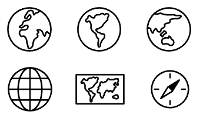
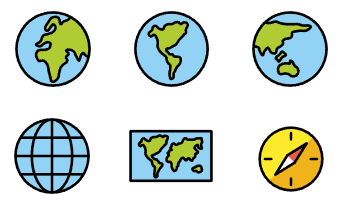

# QGIS Resources
By Rober J

Content shared through the [QGIS resource sharing plugin](https://qgis-contribution.github.io/QGIS-ResourceSharing/index.html)

Avaliable collections:

 

## OpenMoji SVG Black

### SVG black and hollow icons from [OpenMoji Project](https://openmoji.org/)

These icons have been modified from the original repository in order to improve their usage in QGIS:
* Marker color is editable
* Default size adapted
 

## OpenMoji SVG Color

### SVG color icons from [OpenMoji Project](https://openmoji.org/)

These icons have been modified from the original repository in order to improve their usage in QGIS:
* Default size adapted
